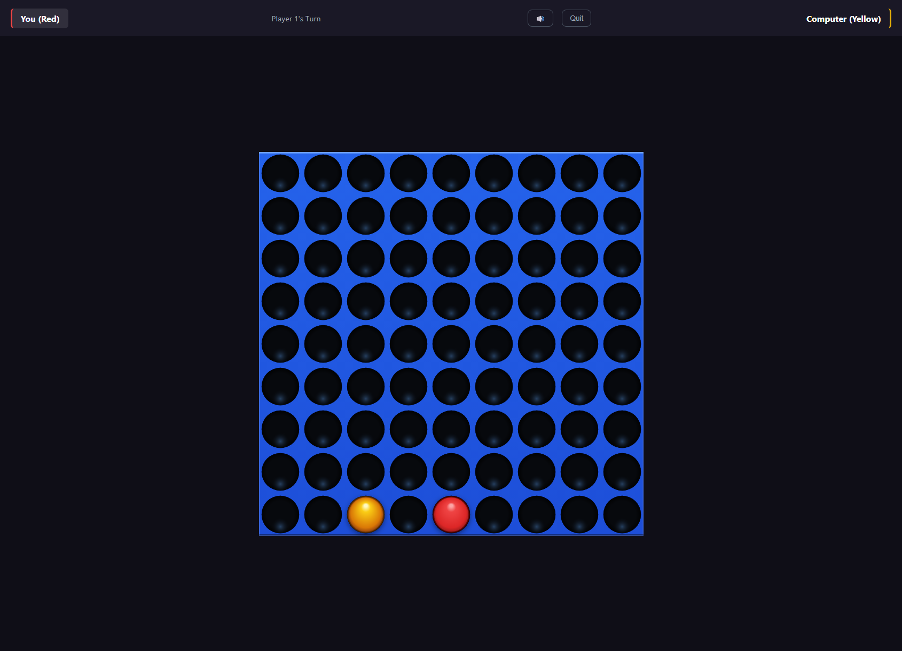

# Connect5

Browser-based Connect-5 game (5-in-a-row variant of Connect 4) with AI and online multiplayer.

## Features

- Three game modes: vs Computer, vs Local Player, vs Online
- AI difficulty levels (easy / medium / hard) using minimax with alpha-beta pruning
- Three board sizes: 7×8, 9×9, 10×10
- Real-time online multiplayer via Socket.IO — join by room code or matchmaking queue
- HTML5 Canvas rendering with piece drop animations and win-line highlighting
- Web Audio API sound effects (no audio files required)
- Dark theme UI, zero third-party frontend frameworks

## Screenshot



## Tech Stack

- **Backend:** Node.js, Express 4.x, Socket.IO 4.x
- **Frontend:** Vanilla JavaScript, HTML5 Canvas, Web Audio API

## Prerequisites

- Node.js ≥ 16

## Quick Start

```bash
npm install
npm start
```

Open [http://localhost:3000](http://localhost:3000) in your browser.

Set a custom port with the `PORT` environment variable:

```bash
PORT=8080 npm start
```

## Game Modes

- **vs Computer** — Single-player against an AI opponent. Easy uses random moves; medium searches 4 plies with center-weighted move ordering; hard searches 7 plies with center-weighted move ordering.
- **vs Local Player** — Two players on the same device alternate turns.
- **vs Online** — Real-time multiplayer. Create a room and share the 4-character code, or join the matchmaking queue to find a random opponent. There is a 60-second turn timer — if a player exceeds it, they forfeit the game. After a game ends, both players can vote to rematch and play again.

## Project Structure

```
connect5/
├── server.js                 # Express server + Socket.IO room/matchmaking logic
├── package.json
└── public/
    ├── index.html            # Single-page app shell
    ├── style.css             # Dark theme CSS
    └── js/
        ├── main.js           # Game flow orchestration & event binding
        ├── game.js           # Board state, move validation, win detection
        ├── ai.js             # Minimax AI with alpha-beta pruning
        ├── renderer.js       # Canvas 2D rendering & animations
        ├── ui.js             # Screen/state management
        ├── socket-client.js  # Socket.IO client wrapper
        └── sound.js          # Web Audio API sound effects
```

## License

MIT License — see [LICENSE](LICENSE) for details.
